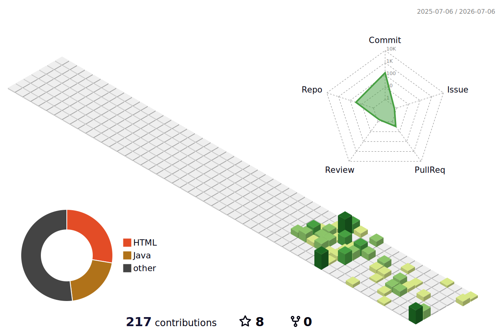

 
 

<!-- 2. 기술 스택 영역 (완벽하게 스타일이 통일된 버전) -->
### ✏️ Learning & Tech Stacks

  
  
  
  
  
  
  <!-- [수정됨] VS Code 배지 스타일을 'for-the-badge'로 변경하여 통일 -->
  

 

<!-- 3. 벨로그 배지는 단독으로 격을 높여 배치 -->

  

 
 

<!-- 4. 3D 기여도 그래프 -->

  

---

